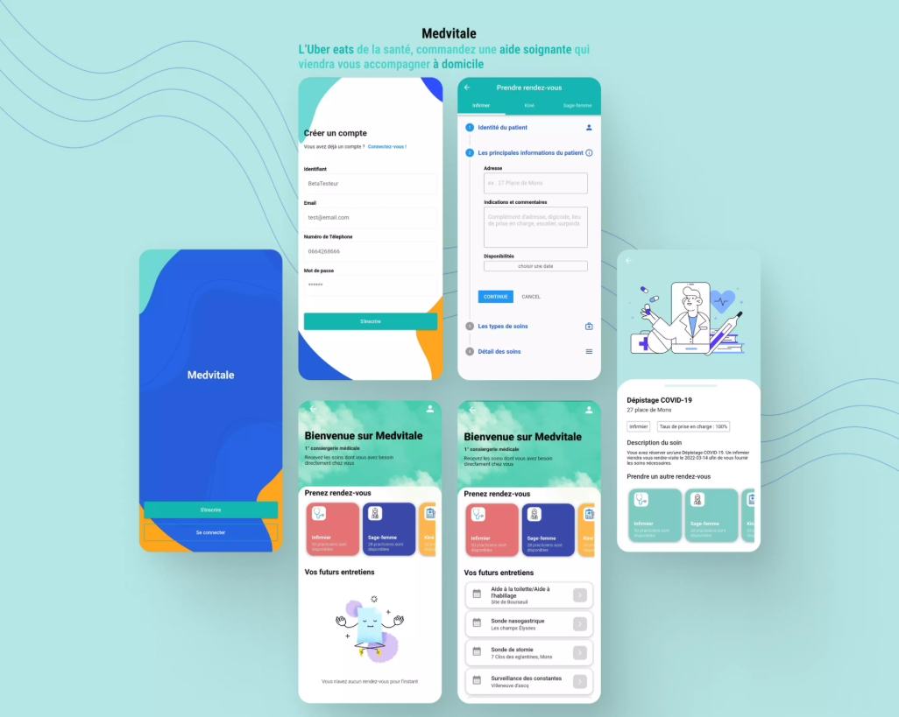
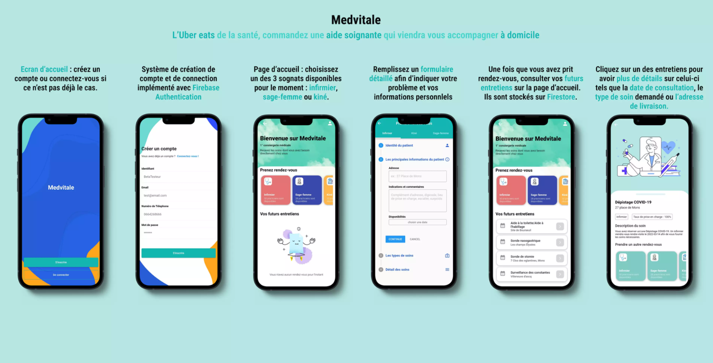

# 📱 App Overview

The following mockups illustrate the **complete user journey**, from authentication to appointment booking and consultation details.

<p align="center">
  
</p>

<p align="center">
  
</p>

---

# Medvitale — Mobile Healthcare Booking App

Medvitale is a **Flutter mobile application** that allows users to **book at-home healthcare services** such as nurses, midwives, or physiotherapists.

The concept can be summarized as:  
**“Uber Eats for healthcare”** — request a healthcare professional who comes directly to your home.

---

## 🚀 Features

- **User authentication**
  - Account creation and login (Firebase Authentication)
- **Caregiver selection**
  - Choose between *Infirmier*, *Sage-femme*, or *Kinésithérapeute*
- **Appointment booking**
  - Multi-step form to collect:
    - Patient identity
    - Address and availability
    - Care type and care details
- **Appointment management**
  - View upcoming medical visits on the home screen
  - Access full appointment details
- **Cloud persistence**
  - Appointments stored in **Firebase Firestore**

---

## 🛠️ Tech Stack

- **Flutter** (Dart)
- **Firebase Authentication**
- **Firebase Firestore**
- Cross-platform support:
  - Android
  - iOS
  - Web

---

## 📂 Project Structure (High Level)

```text
medvitale-app/
├── lib/              # Flutter source code
├── assets/           # Images & UI assets
├── previews/         # README overview images
├── android/          # Android configuration
├── ios/              # iOS configuration
├── web/              # Web configuration
├── pubspec.yaml      # Dependencies
└── README.md


